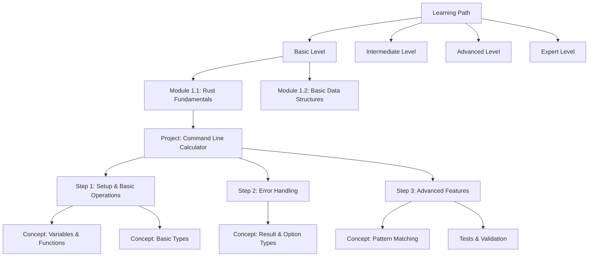

# Design Document: Rust Learning Path

## Overview

This design document outlines the structure and implementation details for a comprehensive Rust learning project. The project follows a progressive learning path from basic to expert levels, using hands-on projects to reinforce learning through practical experience. The design emphasizes the "experience -> repeat -> learning" methodology, ensuring concepts are introduced, practiced, and mastered through real-world applications.

## Architecture

The learning path is structured as a hierarchical system with the following components:

1. **Learning Levels**: The overall structure divides content into distinct levels (Basic, Intermediate, Advanced, Expert).
2. **Learning Modules**: Each level contains multiple learning modules focused on specific concept clusters.
3. **Projects**: Each module includes one or more hands-on projects that apply the concepts.
4. **Steps**: Projects are broken down into manageable implementation steps.
5. **Concepts**: Each step highlights specific Rust concepts being applied.
6. **Tests**: Validation mechanisms to ensure understanding before progression.



## Components and Interfaces

### 1. Project Structure

Each project in the learning path will follow a consistent structure:

```
project-name/
├── README.md           # Project overview, learning objectives, and instructions
├── src/                # Source code directory
│   └── main.rs         # Entry point for the application
├── tests/              # Test directory
│   └── integration_tests.rs  # Integration tests
├── Cargo.toml          # Project dependencies and metadata
└── CONCEPTS.md         # Detailed explanation of Rust concepts used
```

### 2. Learning Level Interface

Each learning level will be presented with a consistent interface:

- **Level Overview**: Description, prerequisites, and learning outcomes
- **Module List**: List of modules contained in the level
- **Progression Criteria**: Clear criteria for when to advance to the next level
- **Resources**: Level-specific resources and references

### 3. Module Interface

Each module will include:

- **Module Overview**: Concepts covered and learning objectives
- **Project List**: Projects that apply the module concepts
- **Concept Reference**: Detailed explanations of all concepts introduced
- **Assessment Criteria**: How mastery of the module is evaluated

### 4. Project Interface

Each project will include:

- **Project Brief**: Overview and objectives
- **Step-by-Step Guide**: Detailed implementation instructions
- **Concept Highlights**: Rust concepts applied in each step
- **Extension Challenges**: Additional tasks to reinforce learning
- **Tests**: Validation tests to verify correct implementation

## Data Models

### Learning Path Model

```rust
struct LearningPath {
    title: String,
    description: String,
    levels: Vec<Level>,
}

struct Level {
    title: String,
    description: String,
    prerequisites: Vec<String>,
    learning_outcomes: Vec<String>,
    modules: Vec<Module>,
}

struct Module {
    title: String,
    description: String,
    concepts: Vec<Concept>,
    projects: Vec<Project>,
}

struct Project {
    title: String,
    description: String,
    difficulty: Difficulty,
    steps: Vec<Step>,
    extensions: Vec<String>,
}

struct Step {
    title: String,
    instructions: String,
    concepts_applied: Vec<String>,
    code_example: Option<String>,
}

struct Concept {
    title: String,
    description: String,
    examples: Vec<String>,
    references: Vec<String>,
}

enum Difficulty {
    Beginner,
    Intermediate,
    Advanced,
    Expert,
}
```

## Level Content Design

### Basic Level

**Focus**: Rust fundamentals and basic programming concepts

**Modules**:
1. **Rust Basics**: Syntax, variables, data types, control flow
2. **Functions and Error Handling**: Functions, error propagation, Result, Option
3. **Basic Ownership**: Understanding Rust's ownership system
4. **Simple Data Structures**: Structs, enums, basic collections

**Projects**:
1. Command Line Calculator
2. File System Explorer
3. Simple Text Processor
4. Basic To-Do List Application

### Intermediate Level

**Focus**: More complex Rust features and programming patterns

**Modules**:
1. **Advanced Ownership**: Borrowing, lifetimes, reference counting
2. **Traits and Generics**: Creating flexible and reusable code
3. **Collections and Iterators**: Working with complex data structures
4. **Error Handling Patterns**: Custom errors, error conversion, failure handling

**Projects**:
1. Library Management System
2. Multi-threaded Web Scraper
3. Custom Data Structure Implementation
4. Command Line Database Tool

### Advanced Level

**Focus**: Advanced Rust features and systems programming

**Modules**:
1. **Concurrency**: Threads, mutexes, atomic operations
2. **Unsafe Rust**: Raw pointers, FFI, unsafe functions
3. **Advanced Traits**: Associated types, operator overloading, trait objects
4. **Macros**: Declarative and procedural macros

**Projects**:
1. Thread Pool Implementation
2. Custom Memory Allocator
3. Binding to C Library
4. Domain-Specific Language with Macros

### Expert Level

**Focus**: Specialized Rust applications and advanced topics

**Modules**:
1. **Async Programming**: Futures, async/await, tokio
2. **Advanced Memory Management**: Custom allocators, memory layouts
3. **Compiler Internals**: Working with the Rust compiler
4. **Performance Optimization**: Benchmarking, profiling, optimization techniques

**Projects**:
1. Asynchronous Network Server
2. Custom Runtime Implementation
3. Compiler Plugin Development
4. High-Performance Data Processing Pipeline

## Error Handling

The learning path will incorporate comprehensive error handling in two dimensions:

1. **Within Projects**: Each project will demonstrate proper Rust error handling techniques appropriate to the level:
   - Basic Level: Simple Result and Option types
   - Intermediate Level: Custom error types and error conversion
   - Advanced Level: Error handling in concurrent contexts
   - Expert Level: Complex error management in async systems

2. **Learning Path Navigation**: The system will handle user progression errors:
   - Missing prerequisites detection
   - Incomplete project validation
   - Concept dependency tracking

## Testing Strategy

Testing will be integrated throughout the learning path:

1. **Project Tests**: Each project will include:
   - Unit tests for individual functions
   - Integration tests for overall functionality
   - Documentation tests for examples

2. **Learning Validation Tests**:
   - Concept quizzes to validate understanding
   - Code challenges to test application of concepts
   - Project review criteria to ensure quality implementation

3. **Test-Driven Development**:
   - Introduction of TDD practices in Intermediate level
   - Increasing emphasis on writing tests first in later levels
   - Test coverage requirements increasing with level progression

## Implementation Considerations

1. **Project Scaffolding**: Each project will provide appropriate scaffolding based on the level:
   - Basic Level: More complete scaffolding with clear TODOs
   - Intermediate Level: Partial scaffolding with design guidance
   - Advanced Level: Minimal scaffolding with architectural guidance
   - Expert Level: Only requirements and specifications

2. **Documentation Integration**:
   - Inline documentation of all example code
   - Links to official Rust documentation for all concepts
   - Progressive introduction to documentation best practices

3. **Community Integration**:
   - Introduction to Rust community resources at appropriate levels
   - Guidance on asking good questions and finding help
   - Introduction to contribution practices in later levels

4. **Progression Tracking**:
   - Clear completion criteria for each component
   - Self-assessment tools for concept mastery
   - Suggested paths based on areas needing reinforcement