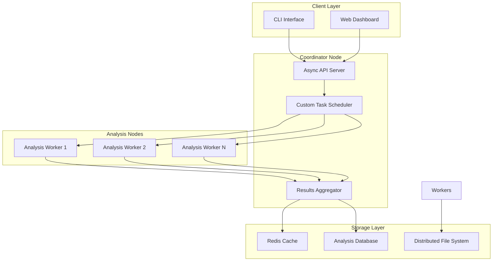

# Expert Level Capstone: Distributed Code Analysis Platform

## Project Overview

This capstone project combines all Expert Level concepts into a comprehensive distributed code analysis platform. You'll build a system that can analyze Rust codebases across multiple nodes, providing real-time insights about code quality, performance characteristics, and potential issues.

The platform demonstrates the integration of:
- **Async Programming**: Network communication and concurrent request handling
- **Custom Runtime**: Specialized task scheduling for analysis workloads
- **Compiler Integration**: Deep code analysis using compiler APIs
- **Performance Optimization**: High-throughput processing of large codebases

## Learning Objectives

By completing this capstone project, you will demonstrate mastery of:

- Designing and implementing complex async systems
- Creating custom runtimes for specialized workloads
- Integrating with Rust compiler internals for code analysis
- Optimizing performance for large-scale data processing
- Coordinating distributed systems with async communication
- Building production-ready Rust applications

## Architecture Overview



## Prerequisites

Before starting this capstone, you must have completed:
- All Expert Level individual projects (5.1-5.5)
- Understanding of distributed systems concepts
- Familiarity with database operations
- Knowledge of web protocols and APIs

## Project Structure

```
capstone-distributed-analysis/
├── README.md                           # This file
├── Cargo.toml                          # Workspace configuration
├── coordinator/                        # Coordinator node implementation
│   ├── Cargo.toml
│   ├── src/
│   │   ├── main.rs                     # Coordinator entry point
│   │   ├── api/                        # REST API implementation
│   │   ├── scheduler/                  # Custom task scheduler
│   │   └── aggregator/                 # Results aggregation
├── worker/                             # Analysis worker implementation
│   ├── Cargo.toml
│   ├── src/
│   │   ├── main.rs                     # Worker entry point
│   │   ├── analyzer/                   # Code analysis engine
│   │   ├── compiler/                   # Compiler integration
│   │   └── performance/                # Performance optimization
├── shared/                             # Shared libraries and types
│   ├── Cargo.toml
│   ├── src/
│   │   ├── lib.rs
│   │   ├── protocol/                   # Network protocol definitions
│   │   ├── types/                      # Shared data types
│   │   └── utils/                      # Common utilities
├── client/                             # Client applications
│   ├── cli/                            # Command-line interface
│   └── web/                            # Web dashboard
├── tests/                              # Integration tests
│   ├── distributed_tests.rs
│   ├── performance_tests.rs
│   └── load_tests.rs
├── docker/                             # Docker configurations
│   ├── coordinator.Dockerfile
│   ├── worker.Dockerfile
│   └── docker-compose.yml
└── CONCEPTS.md                         # Comprehensive concept guide
```

## Implementation Phases

### Phase 1: Foundation and Shared Components (Week 1)

**Objective**: Establish the foundation with shared types, protocols, and basic async infrastructure.

**Tasks**:
1. Set up the workspace with proper dependency management
2. Define shared data types and network protocols
3. Implement basic async networking utilities
4. Create configuration management system

**Concepts Applied**:
- Workspace management and dependency coordination
- Protocol design for distributed systems
- Async networking foundations
- Configuration and environment management

**Deliverables**:
- Working shared library with core types
- Network protocol definitions
- Basic async utilities
- Configuration system

### Phase 2: Custom Runtime for Analysis Tasks (Week 2)

**Objective**: Build a specialized async runtime optimized for code analysis workloads.

**Tasks**:
1. Design a custom executor with analysis-specific optimizations
2. Implement priority-based task scheduling
3. Create memory-efficient task management
4. Add performance monitoring and metrics

**Concepts Applied**:
- Custom async runtime implementation
- Task scheduling algorithms
- Memory management optimization
- Performance instrumentation

**Deliverables**:
- Custom runtime with specialized executor
- Priority-based task scheduler
- Performance monitoring system
- Runtime benchmarks and validation

### Phase 3: Compiler Integration and Analysis Engine (Week 2)

**Objective**: Integrate with Rust compiler APIs to perform deep code analysis.

**Tasks**:
1. Create compiler plugin for extracting analysis data
2. Implement AST traversal for code metrics
3. Build performance analysis using compiler insights
4. Add custom lint rules for code quality

**Concepts Applied**:
- Compiler API integration
- AST analysis and traversal
- Static code analysis techniques
- Custom lint development

**Deliverables**:
- Compiler integration module
- Code analysis engine
- Performance analysis tools
- Custom lint implementations

### Phase 4: High-Performance Processing Pipeline (Week 3)

**Objective**: Optimize the analysis pipeline for processing large codebases efficiently.

**Tasks**:
1. Implement SIMD-optimized text processing
2. Create memory-mapped file handling for large projects
3. Build parallel analysis pipeline
4. Add caching and incremental analysis

**Concepts Applied**:
- SIMD optimization techniques
- Memory-mapped I/O
- Parallel processing patterns
- Caching strategies

**Deliverables**:
- Optimized text processing engine
- Parallel analysis pipeline
- Incremental analysis system
- Performance benchmarks

### Phase 5: Distributed Coordination System (Week 3)

**Objective**: Build the coordinator node that manages distributed analysis tasks.

**Tasks**:
1. Implement async API server with proper error handling
2. Create task distribution and load balancing
3. Build results aggregation system
4. Add health monitoring and fault tolerance

**Concepts Applied**:
- Async web server implementation
- Distributed task coordination
- Load balancing algorithms
- Fault tolerance patterns

**Deliverables**:
- Coordinator node implementation
- Task distribution system
- Results aggregation service
- Health monitoring dashboard

### Phase 6: Analysis Worker Nodes (Week 4)

**Objective**: Implement worker nodes that perform the actual code analysis.

**Tasks**:
1. Create worker registration and heartbeat system
2. Implement analysis task execution
3. Add resource management and throttling
4. Build result reporting and error handling

**Concepts Applied**:
- Worker node architecture
- Resource management
- Error handling in distributed systems
- Performance optimization

**Deliverables**:
- Worker node implementation
- Resource management system
- Error handling and recovery
- Performance optimization

### Phase 7: Client Interfaces and Integration (Week 4)

**Objective**: Create user-friendly interfaces for interacting with the platform.

**Tasks**:
1. Build CLI interface for submitting analysis jobs
2. Create web dashboard for monitoring and results
3. Implement real-time updates using WebSockets
4. Add comprehensive documentation

**Concepts Applied**:
- CLI design and implementation
- Web interface development
- Real-time communication
- Documentation and user experience

**Deliverables**:
- Command-line interface
- Web dashboard
- Real-time monitoring
- User documentation

### Phase 8: Testing, Deployment, and Optimization (Week 5)

**Objective**: Ensure production readiness with comprehensive testing and deployment.

**Tasks**:
1. Create comprehensive integration tests
2. Implement load testing and performance validation
3. Set up containerized deployment
4. Add monitoring and observability

**Concepts Applied**:
- Integration testing strategies
- Load testing and performance validation
- Containerization and deployment
- Observability and monitoring

**Deliverables**:
- Complete test suite
- Load testing framework
- Docker deployment configuration
- Monitoring and alerting system

## Success Criteria

Your capstone implementation should demonstrate:

### Functional Requirements
- [ ] Analyze Rust codebases with 10,000+ lines of code
- [ ] Distribute analysis across multiple worker nodes
- [ ] Provide real-time progress updates
- [ ] Generate comprehensive analysis reports
- [ ] Handle node failures gracefully
- [ ] Support incremental analysis for code changes

### Performance Requirements
- [ ] Process 1MB of source code per second per worker
- [ ] Handle 100+ concurrent analysis requests
- [ ] Scale linearly with additional worker nodes
- [ ] Maintain <100ms API response times
- [ ] Use <50% CPU on coordinator node under normal load

### Quality Requirements
- [ ] 90%+ test coverage across all components
- [ ] Zero memory leaks under continuous operation
- [ ] Graceful degradation under high load
- [ ] Comprehensive error handling and logging
- [ ] Production-ready configuration management

## Extension Challenges

Once you complete the core implementation, consider these advanced extensions:

1. **Machine Learning Integration**: Add ML-based code quality predictions
2. **IDE Integration**: Create plugins for popular IDEs
3. **Security Analysis**: Implement security vulnerability detection
4. **Code Similarity Detection**: Add plagiarism and code clone detection
5. **Performance Prediction**: Predict runtime performance from static analysis
6. **Multi-Language Support**: Extend to analyze other programming languages
7. **Cloud Deployment**: Deploy on Kubernetes with auto-scaling
8. **Advanced Visualization**: Create interactive code visualization tools

## Resources and References

### Async Programming
- [Tokio Documentation](https://tokio.rs/)
- [Async Book](https://rust-lang.github.io/async-book/)
- [Async Ecosystem](https://blog.yoshuawuyts.com/async-ecosystem/)

### Custom Runtimes
- [Futures Explained](https://cfsamson.github.io/books-futures-explained/)
- [Building an Async Runtime](https://tokio.rs/blog/2020-04-prelude)
- [Runtime Design Patterns](https://without.boats/blog/futures-and-tasks/)

### Compiler Integration
- [Rust Compiler Development Guide](https://rustc-dev-guide.rust-lang.org/)
- [Procedural Macros](https://doc.rust-lang.org/reference/procedural-macros.html)
- [Clippy Development](https://github.com/rust-lang/rust-clippy)

### Performance Optimization
- [Rust Performance Book](https://nnethercote.github.io/perf-book/)
- [SIMD in Rust](https://doc.rust-lang.org/std/simd/)
- [Parallel Processing with Rayon](https://docs.rs/rayon/)

### Distributed Systems
- [Distributed Systems Concepts](https://pdos.csail.mit.edu/6.824/)
- [Consensus Algorithms](https://raft.github.io/)
- [Microservices Patterns](https://microservices.io/patterns/)

## Getting Started

1. **Environment Setup**:
   ```bash
   # Clone the learning path repository
   cd rust-learning-path/expert/capstone-distributed-analysis
   
   # Build all components
   cargo build --workspace
   
   # Run tests
   cargo test --workspace
   ```

2. **Development Workflow**:
   ```bash
   # Start coordinator node
   cargo run --bin coordinator
   
   # Start worker nodes (in separate terminals)
   cargo run --bin worker -- --node-id worker1
   cargo run --bin worker -- --node-id worker2
   
   # Submit analysis job
   cargo run --bin cli -- analyze --project /path/to/rust/project
   ```

3. **Docker Deployment**:
   ```bash
   # Build and start all services
   docker-compose up --build
   
   # Scale workers
   docker-compose up --scale worker=5
   ```

This capstone project represents the culmination of your Expert Level learning journey. It integrates all the advanced concepts you've learned and demonstrates your ability to build complex, production-ready Rust applications. Take your time to understand each component and how they work together to create a powerful distributed system.

## Timeline and Milestones

**Total Duration**: 5 weeks (part-time) or 2-3 weeks (full-time)

**Week 1**: Foundation and shared components
**Week 2**: Custom runtime and compiler integration  
**Week 3**: Performance optimization and coordination
**Week 4**: Worker implementation and client interfaces
**Week 5**: Testing, deployment, and documentation

Each phase builds upon the previous ones, so ensure you complete each milestone before moving to the next. This project will challenge you to apply everything you've learned and demonstrate true expertise in Rust systems programming.